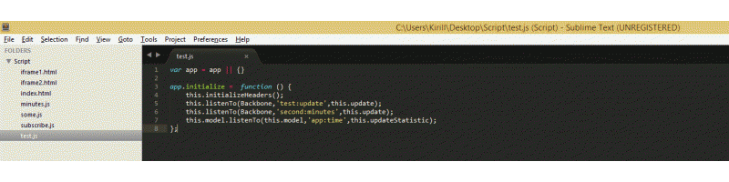

Capo
====

Sublime Text 3 plugin which allows you to keep all your events together in event-driven architecture. Using it you can easily find all publish/subscribers for given event and navigate to the file with it.



* [How to install](#how-to-install)
* [Available actions](#available-actions)
* [Plugin Settings](#plugin-settings)
* [Performance & Troubleshooting](#performance--troubleshooting)
* [Useful links](#useful-links)

## How to install ##

With [Package Control](http://wbond.net/sublime_packages/package_control):

1. Run “Package Control: Install Package” command, find and install `Capo` plugin.
2. Restart ST editor (if required)

Manually:

1. Clone or [download](https://github.com/confa/capo/archive/master.zip) git repo into your packages folder (in ST, find Browse Packages... menu item to open this folder)
2. Restart ST editor (if required)

## Available actions ##

Start searching in current line:
* <kbd>Alt+D</kbd>
* <kbd>Right click + Capo this</kbd>

## Plugin Settings ##

Sublime Text is very agile text editor which allows you easily bind needed shortcuts to plugin actions and change default plugin settings. 

Default capo settings are listed in `capo.sublime-settings` file. Here you can specify default mediators and methods, which will be included into search query. 
By default capo uses `folder_exclude_pattern` from your `project-file` settings and extend it with values which are listed in capo settings. You can disable this by changing `useDefaultExcludePattern` to false.

If you unhappy with default shortcut (<kbd>Alt+D</kbd>) you can refer `Default (Your-OS-Name).sublime-keymap` and change it.

## Performance & Troubleshooting ##

For better plugin's performace set up your project's `folder_exclude_pattern` or use default values from capo settings. Try to exclude from search as much as possible items (minified sources, temporary build folders etc). Be aware that first search can be longer due to cache building. 

Keep in mind that capo won't find the event subsriptions defined within one name and delimeted with space.

```js
this.listenTo('first:message second:message etc', callback)
```

The plugin will interpret `first:message second:message etc` as one event.

## Useful Links ##

Also find usefull npm module for managing your events and creating html reports.

[msemenistyi/capo](https://github.com/msemenistyi/capo)